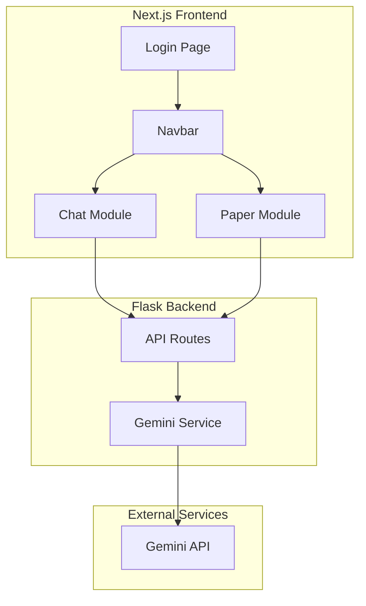

# Design Document: LockAI Core

## Overview

LockAI 是浙江大学 DFM 街舞社 Funk&Love 舞队的内部 AI 应用平台，采用前后端分离架构。前端使用 Next.js 15+ 和 Tailwind CSS 构建，后端使用 Flask + Python 提供 API 服务，集成 Google Gemini AI 模型。

系统包含三个主要模块：
- **认证模块**: Mock SSO 登录流程 (LockAuth)
- **聊天模块**: 与 Gemini AI 的实时对话
- **论文模块**: LaTeX 渲染、PDF 阅读和 AI 辅助功能

### 品牌资源

- **Favicon**: https://funkandlove-main.s3.bitiful.net/public/favicon.ico
- **Logo (白色)**: https://funkandlove-main.s3.bitiful.net/public/icon-white.png
- **Logo (其他颜色)**: 修改后缀获取不同颜色版本

## Architecture



### 技术栈

**前端:**
- Next.js 16.x (App Router)
- React 19.x
- Tailwind CSS 4.x
- TypeScript
- react-pdf (PDF 渲染)
- KaTeX (LaTeX 渲染)

**后端:**
- Python 3.10+
- Flask 3.x
- google-generativeai (Gemini SDK)
- flask-cors

## Components and Interfaces

### 前端组件结构

```
src/
├── app/
│   ├── layout.tsx          # 根布局
│   ├── page.tsx            # 登录页 (首页)
│   ├── chat/
│   │   └── page.tsx        # 聊天页面
│   └── paper/
│       └── page.tsx        # 论文页面
├── components/
│   ├── Navbar.tsx          # 导航栏
│   ├── chat/
│   │   ├── ChatContainer.tsx
│   │   ├── MessageList.tsx
│   │   ├── MessageInput.tsx
│   │   └── Message.tsx
│   └── paper/
│       ├── PaperContainer.tsx
│       ├── LatexEditor.tsx
│       ├── LatexPreview.tsx
│       ├── PdfViewer.tsx
│       └── AiAssistPanel.tsx
├── lib/
│   ├── api.ts              # API 客户端
│   └── auth.ts             # 认证状态管理
└── types/
    └── index.ts            # TypeScript 类型定义
```

### 核心接口定义

```typescript
// types/index.ts

// 聊天消息
interface ChatMessage {
  id: string;
  role: 'user' | 'assistant';
  content: string;
  timestamp: Date;
}

// 聊天请求
interface ChatRequest {
  message: string;
  history?: ChatMessage[];
}

// 聊天响应
interface ChatResponse {
  message: string;
  error?: string;
}

// 论文 AI 辅助请求
interface PaperAssistRequest {
  text: string;
  action: 'explain' | 'summarize' | 'translate';
}

// 论文 AI 辅助响应
interface PaperAssistResponse {
  result: string;
  error?: string;
}

// 认证状态
interface AuthState {
  isAuthenticated: boolean;
  user?: {
    name: string;
    email: string;
  };
}
```

### 后端 API 接口

```python
# Flask API Routes

# POST /api/chat
# Request: { "message": string, "history": ChatMessage[] }
# Response: { "message": string } | { "error": string }

# POST /api/paper/assist
# Request: { "text": string, "action": "explain" | "summarize" | "translate" }
# Response: { "result": string } | { "error": string }
```

## Data Models

### 前端状态管理

```typescript
// 聊天状态
interface ChatState {
  messages: ChatMessage[];
  isLoading: boolean;
  error: string | null;
}

// 论文状态
interface PaperState {
  latexContent: string;
  pdfFile: File | null;
  currentPage: number;
  totalPages: number;
  zoom: number;
  selectedText: string;
  aiAssistResult: string | null;
  isAiLoading: boolean;
}
```

### 后端数据结构

```python
# Gemini 请求配置
class GeminiConfig:
    model: str = "gemini-pro"
    temperature: float = 0.7
    max_tokens: int = 2048

# 聊天历史格式 (Gemini SDK)
class ChatHistory:
    role: str  # "user" | "model"
    parts: list[str]
```

## Correctness Properties

*A property is a characteristic or behavior that should hold true across all valid executions of a system-essentially, a formal statement about what the system should do. Properties serve as the bridge between human-readable specifications and machine-verifiable correctness guarantees.*


### Property 1: Route Protection

*For any* unauthenticated user attempting to access any protected route (chat, paper), the system should redirect them to the login page.

**Validates: Requirements 1.3**

### Property 2: Navigation Routing Consistency

*For any* navigation link in the Navbar, clicking it should navigate to the corresponding route, and the active state should correctly reflect the current route.

**Validates: Requirements 2.2, 2.3**

### Property 3: Chat Message Round-Trip

*For any* valid user message sent through the chat interface, the message should be transmitted to the backend, forwarded to Gemini, and the response should be displayed in the chat. The conversation history should be maintained in order, and errors should be displayed as user-friendly messages.

**Validates: Requirements 3.2, 3.3, 3.4, 3.6, 3.7**

### Property 4: LaTeX Rendering Correctness

*For any* valid LaTeX input, the Paper_Module should render it correctly. For any invalid LaTeX input, the system should display an error indicator without crashing.

**Validates: Requirements 4.1, 4.2, 4.3**

### Property 5: PDF Viewer State Consistency

*For any* valid PDF file, the viewer should display it correctly. For any page navigation action (next, previous, go to page), the current page state should update correctly and remain within valid bounds. For any zoom action, the zoom level should change appropriately.

**Validates: Requirements 5.1, 5.2, 5.3, 5.4**

### Property 6: AI Assist Round-Trip

*For any* text selection and AI assist request, the selected text should be sent to the backend, forwarded to Gemini, and the response should be displayed in the side panel.

**Validates: Requirements 6.2, 6.3**

### Property 7: Backend Request Validation

*For any* request to the Flask backend, the request format should be validated. For any invalid request, a 400 error with a descriptive message should be returned.

**Validates: Requirements 7.3, 7.4**

## Error Handling

### 前端错误处理

1. **网络错误**: 显示 "网络连接失败，请检查网络设置" 提示，提供重试按钮
2. **API 错误**: 根据错误码显示对应的用户友好消息
3. **LaTeX 解析错误**: 在预览区域显示错误位置和提示
4. **PDF 加载错误**: 显示 "PDF 加载失败" 提示，支持重新上传

### 后端错误处理

1. **请求验证错误**: 返回 400 状态码和详细错误信息
2. **Gemini API 错误**: 
   - 速率限制: 返回 429 状态码，提示用户稍后重试
   - 服务不可用: 返回 503 状态码
   - 其他错误: 返回 500 状态码，记录日志
3. **认证错误**: 返回 401 状态码

### 错误响应格式

```typescript
interface ErrorResponse {
  error: string;      // 用户友好的错误消息
  code: string;       // 错误代码 (如 "RATE_LIMITED", "INVALID_REQUEST")
  details?: string;   // 可选的详细信息 (仅开发环境)
}
```

## Testing Strategy

### 单元测试

使用 Jest + React Testing Library 进行前端单元测试：

- 组件渲染测试
- 用户交互测试
- 状态管理测试

使用 pytest 进行后端单元测试：

- API 端点测试
- 请求验证测试
- Gemini 服务 mock 测试

### 属性测试

使用 fast-check 进行前端属性测试，每个属性测试运行至少 100 次迭代：

- **Property 1**: 生成随机路由和认证状态，验证路由保护
- **Property 2**: 生成随机导航操作，验证路由一致性
- **Property 3**: 生成随机消息序列，验证聊天往返
- **Property 4**: 生成随机 LaTeX 字符串，验证渲染行为
- **Property 5**: 生成随机 PDF 操作序列，验证状态一致性
- **Property 6**: 生成随机文本和操作，验证 AI 辅助往返
- **Property 7**: 生成随机请求格式，验证后端验证

使用 hypothesis 进行后端属性测试：

- 请求格式验证
- 错误处理一致性

### 集成测试

- 前后端 API 集成测试
- Gemini API 集成测试 (使用 mock)

### 测试配置

```javascript
// jest.config.js
module.exports = {
  testEnvironment: 'jsdom',
  setupFilesAfterEnv: ['<rootDir>/jest.setup.js'],
  moduleNameMapper: {
    '^@/(.*)$': '<rootDir>/src/$1',
  },
};
```

```python
# pytest.ini
[pytest]
testpaths = tests
python_files = test_*.py
python_functions = test_*
```
